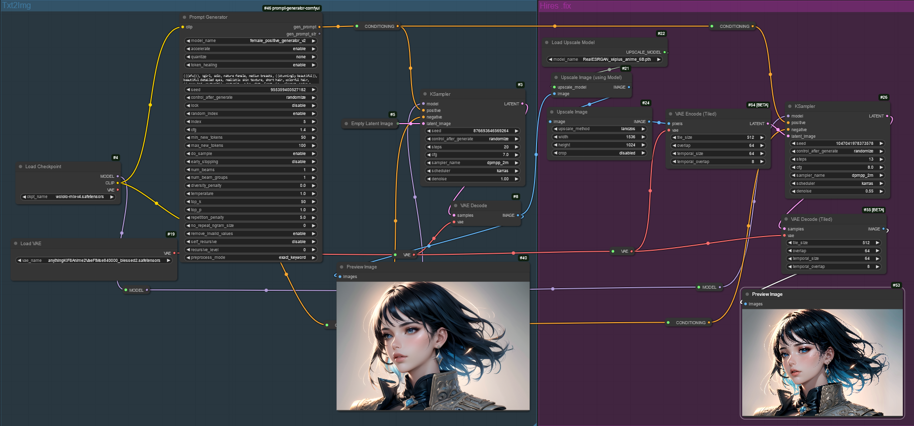

# prompt-generator-comfyui
Custom AI prompt generator node for [ComfyUI](https://github.com/comfyanonymous/ComfyUI). With this node, you can use text generation models to generate prompts. Before using, text generation model has to be trained with prompt dataset.

# Table Of Contents
- [prompt-generator-comfyui](#prompt-generator-comfyui)
- [Table Of Contents](#table-of-contents)
- [Setup](#setup)
  - [For Portable Installation of the ComfyUI](#for-portable-installation-of-the-comfyui)
  - [For Manual Installation of the ComfyUI](#for-manual-installation-of-the-comfyui)
  - [For ComfyUI Manager Users](#for-comfyui-manager-users)
- [Features](#features)
- [Example Workflow](#example-workflow)
- [Pretrained Prompt Models](#pretrained-prompt-models)
  - [Dataset](#dataset)
  - [Models](#models)
- [Variables](#variables)
  - [Quantization](#quantization)
  - [Random Generation](#random-generation)
  - [Lock The Generation](#lock-the-generation)
  - [How Recursive Works?](#how-recursive-works)
  - [How Preprocess Mode Works?](#how-preprocess-mode-works)
    - [Example](#example)
- [Troubleshooting](#troubleshooting)
  - [Package Version](#package-version)
    - [For Manual Installation of the ComfyUI](#for-manual-installation-of-the-comfyui-1)
    - [For Portable Installation of the ComfyUI](#for-portable-installation-of-the-comfyui-1)
  - [Automatic Installation](#automatic-installation)
    - [For Manual Installation of the ComfyUI](#for-manual-installation-of-the-comfyui-2)
    - [For Portable Installation of the ComfyUI](#for-portable-installation-of-the-comfyui-2)
  - [New Updates On The Node](#new-updates-on-the-node)
- [Contributing](#contributing)
- [Example Outputs](#example-outputs)

# Setup
## For Portable Installation of the ComfyUI
- [x] Automatic installation is added for portable version.
- Clone the repository with ```git clone https://github.com/alpertunga-bile/prompt-generator-comfyui.git``` command under ```custom_nodes``` folder.
- Go to the ```ComfyUI_windows_portable``` folder and run the **run_nvidia_gpu.bat** file
- Open the ```hires.fixWithPromptGenerator.json``` or ```basicWorkflowWithPromptGenerator.json``` workflow
- Put your generator under the ```models/prompt_generators``` folder. You can create your prompt generator with [this repository](https://github.com/alpertunga-bile/prompt-markdown-parser). You have to put generator as folder. Do not just put ```pytorch_model.bin``` file for example.
- Click ```Refresh``` button in ComfyUI

## For Manual Installation of the ComfyUI
- Clone the repository with ```git clone https://github.com/alpertunga-bile/prompt-generator-comfyui.git``` command under ```custom_nodes``` folder.
- Run the ComfyUI
- Open the ```hires.fixWithPromptGenerator.json``` or ```basicWorkflowWithPromptGenerator.json``` workflow
- Put your generator under the ```models/prompt_generators``` folder. You can create your prompt generator with [this repository](https://github.com/alpertunga-bile/prompt-markdown-parser). You have to put generator as folder. Do not just put ```pytorch_model.bin``` file for example.
- Click ```Refresh``` button in ComfyUI

## For ComfyUI Manager Users
- Download the node with [ComfyUI Manager](https://github.com/ltdrdata/ComfyUI-Manager)
- Restart the ComfyUI
- Open the ```hires.fixWithPromptGenerator.json``` or ```basicWorkflowWithPromptGenerator.json``` workflow
- Put your generator under the ```models/prompt_generators``` folder. You can create your prompt generator with [this repository](https://github.com/alpertunga-bile/prompt-markdown-parser). You have to put generator as folder. Do not just put ```pytorch_model.bin``` file for example.
- Click ```Refresh``` button in ComfyUI

# Features
- Multiple output generation is added. You can choose from 5 outputs with the index value. You can check the generated prompts from the log file and terminal. The prompts are logged and printed in order. 
- Randomness is added. See [this section](#random-generation).
- Quantization is added with [Quanto](https://github.com/huggingface/quanto) and [Bitsandbytes](https://huggingface.co/docs/bitsandbytes/main/en/index) packages. See [this section](#quantization).
- Lora adapter model loading is added with [Peft](https://huggingface.co/docs/peft/en/index) package. (The feature is not full tested in this repository because of my VRAM but I am using the same implementation in Google Colab for training and inference and it is working there)
- Optimizations are done with [Optimum](https://github.com/huggingface/optimum) package.
- ONNX and transformers models are supported.
- Preprocessing outputs. See [this section](#how-preprocess-mode-works).
- Recursive generation is supported. See [this section](#how-recursive-works).
- Print generated text to terminal and log the node's state under the ```generated_prompts``` folder with date as filename.

# Example Workflow



- **Prompt Generator Node** may look different with final version but workflow in ComfyUI is not going to change

# Pretrained Prompt Models

- You can find the models in [this link](https://drive.google.com/drive/folders/1c21kMH6FTaia5C8239okL3Q0wJnnWc1N?usp=share_link)

- For to use the pretrained model follow these steps:
  - Download the model and unzip to ```models/prompt_generators``` folder.
  - Click ```Refresh``` button in ComfyUI.
  - Then select the generator with the node's ```model_name``` variable (If you can't see the generator, restart the ComfyUI).

## Dataset

- The dataset has 2.054.314 rows of unique prompts currently.
- Process of data cleaning and gathering can be found [here](https://github.com/alpertunga-bile/prompt-markdown-parser/blob/master/sources/CLI/CLICivitai.py)
    
## Models

- The model versions are used to differentiate models rather than showing which one is better.
- The v2 version is the latest trained model and the v4 model is an experimental model.

- female_positive_generator_v2 | **(Training In Process)**
  - Base model
  - using [distilgpt2](https://huggingface.co/distilgpt2) model
  - Training Loss ~0.47
  - ~500 MB 
  
- female_positive_generator_v3 | **(Training In Process)**
  - Base model
  - using [bigscience/bloom-560m](https://huggingface.co/bigscience/bloom-560m) model
  - ~1.3 GB

- female_positive_generator_v4 | **Experimental**
  - Lora adapter model
  - using [senseable/WestLake-7B-v2](https://huggingface.co/senseable/WestLake-7B-v2) model as the base model
  - Base model is ~14 GB

# Variables

|      Variable Names       | Definitions                                                                                                                                                                                                                                                             |
| :-----------------------: | :---------------------------------------------------------------------------------------------------------------------------------------------------------------------------------------------------------------------------------------------------------------------- |
|      **model_name**       | Folder name that contains the model                                                                                                                                                                                                                                     |
|      **accelerate**       | Open optimizations. Some of the models are not supported by BetterTransformer ([Check your model](https://huggingface.co/docs/optimum/bettertransformer/overview#supported-models)). If it is not supported switch this option to disable or convert your model to ONNX |
|       **quantize**        | Quantize the model. The quantize type is changed based on your OS and torch version. ```none``` value disables the quantization. Check [this section](#quantization) for more information                                                                               |
|        **prompt**         | Input prompt for the generator                                                                                                                                                                                                                                          |
|         **seed**          | Seed value for the model                                                                                                                                                                                                                                                |
|         **lock**          | Lock the generation and select from the last generated prompts with index value                                                                                                                                                                                         |
|     **random_index**      | Random index value in [1, 5]. If the value is __enable__, the __index__ value is not used                                                                                                                                                                               |
|         **index**         | User specified index value for selecting prompt from the generated prompts. **random_index** variable must be __disable__                                                                                                                                               |
|          **cfg**          | CFG is enabled by setting guidance_scale > 1. Higher guidance scale encourages the model to generate samples that are more closely linked to the input prompt, usually at the expense of poorer quality                                                                 |
|    **min_new_tokens**     | The minimum numbers of tokens to generate, ignoring the number of tokens in the prompt.                                                                                                                                                                                 |
|    **max_new_tokens**     | The maximum numbers of tokens to generate, ignoring the number of tokens in the prompt.                                                                                                                                                                                 |
|       **do_sample**       | Whether or not to use sampling; use greedy decoding otherwise                                                                                                                                                                                                           |
|    **early_stopping**     | Controls the stopping condition for beam-based methods, like beam-search                                                                                                                                                                                                |
|       **num_beams**       | Number of steps for each search path                                                                                                                                                                                                                                    |
|    **num_beam_groups**    | Number of groups to divide num_beams into in order to ensure diversity among different groups of beams                                                                                                                                                                  |
|   **diversity_penalty**   | This value is subtracted from a beam’s score if it generates a token same as any beam from other group at a particular time. Note that diversity_penalty is only effective if ```group beam search``` is enabled.                                                       |
|      **temperature**      | How sensitive the algorithm is to selecting low probability options                                                                                                                                                                                                     |
|         **top_k**         | The number of highest probability vocabulary tokens to keep for top-k-filtering                                                                                                                                                                                         |
|         **top_p**         | If set to float < 1, only the smallest set of most probable tokens with probabilities that add up to top_p or higher are kept for generation                                                                                                                            |
|  **repetition_penalty**   | The parameter for repetition penalty. 1.0 means no penalty                                                                                                                                                                                                              |
| **no_repeat_ngram_size**  | The size of an n-gram that cannot occur more than once. (0=infinity)                                                                                                                                                                                                    |
| **remove_invalid_values** | Whether to remove possible nan and inf outputs of the model to prevent the generation method to crash. Note that using remove_invalid_values can slow down generation.                                                                                                  |
|    **self_recursive**     | See [this section](#how-recursive-works)                                                                                                                                                                                                                                |
|    **recursive_level**    | See [this section](#how-recursive-works)                                                                                                                                                                                                                                |
|    **preprocess_mode**    | See [this section](#how-preprocess-mode-works)                                                                                                                                                                                                                          |

- For more information, follow [this link](https://huggingface.co/docs/transformers/v4.31.0/en/main_classes/text_generation#transformers.GenerationConfig).
- Check [this link](https://huggingface.co/docs/transformers/v4.31.0/en/generation_strategies#text-generation-strategies) for text generation strategies.

## Quantization
- Quantization is added with [Quanto](https://github.com/huggingface/quanto) and [Bitsandbytes](https://huggingface.co/docs/bitsandbytes/main/en/index) packages.
- The Quanto package requires ```torch >= 2.2``` and Bitsandbytes package works out-of-box with Linux OS. So the node is checking which package to use:
  - If requirements are not specified for this packages, you can not use the ```quantize``` variable and it has only ```none``` value.
  - If the Quanto requirements are filled then you can choose between ```none, int8, float8, int4``` values.
  - If the Bitsandbytes requirements are filled then you can choose between ```none, int8, int4``` values.
- If your environment can use the Quanto and Bitsandbytes packages, the node selects the Bitsandbytes package.
   

## Random Generation
- For random generation:
  - Enable **do_sample**

- You can find this text generation strategy from the upper link. The strategy is called **Multinomial sampling**.
- Changing variable of **do_sample** to __disable__ gives deterministic generation.
- For more randomness, you can:
  - Enable **random_index** variable
  - Increase **recursive_level**
  - Enable **self_recursive**
  
## Lock The Generation
- Enabling the **lock** variable skip the generation and let you choose from the last generated prompts.
- You can choose from the **index** value or use the **random_index**.
- If **random_index** is enabled, the **index** value is ignored.

## How Recursive Works?
- Let's say we give ```a, ``` as seed and recursive level is 1. I am going to use the same outputs for this example to explain the functionality more accurately.
- With self recursive, let's say generator's output is ```b```. So next seed is going to be ```b``` and generator's output is ```c```. Final output is ```a, c```. It can be used for generating random outputs.
- Without self recursive, let's say generator's output is ```b```. So next seed is going to be ```a, b``` and generator's output is ```c```. Final output is ```a, b, c```. It can be used for more accurate prompts.

## How Preprocess Mode Works?
- **exact_keyword** => ```(masterpiece), ((masterpiece))``` is not allowed. Checking the pure keyword without parantheses and weights. The algorithm is adding the prompts from the beginning of the generated text, so add important prompts to seed.
- **exact_prompt** => ```(masterpiece), ((masterpiece))``` is allowed but ```(masterpiece), (masterpiece)``` is not. Checking the exact match of the prompt.
- **none** => Everything is allowed even the repeated prompts.
### Example
```
# ---------------------------------------------------------------------- Original ---------------------------------------------------------------------- #
((masterpiece)), ((masterpiece:1.2)), (masterpiece), blahblah, blah, blah, ((blahblah)), (((((blah))))), ((same prompt)), same prompt, (masterpiece)
# ------------------------------------------------------------- Preprocess (Exact Keyword) ------------------------------------------------------------- #
((masterpiece)), blahblah, blah, ((same prompt))
# ------------------------------------------------------------- Preprocess (Exact Prompt) -------------------------------------------------------------- #
((masterpiece)), ((masterpiece:1.2)), (masterpiece), blahblah, blah, ((blahblah)), (((((blah))))), ((same prompt)), same prompt
```

# Troubleshooting

- If the below solutions are not fixed your issue please create an issue with ```bug``` label

## Package Version

- The node is based on [transformers](https://github.com/huggingface/transformers) and [optimum](https://github.com/huggingface/optimum) packages. So most of the problems may be caused from these packages. For overcome these problems you can try to update these packages:

### For Manual Installation of the ComfyUI

1. Activate the virtual environment if there is one.
2. Run the ```pip install --upgrade transformers optimum optimum[onnxruntime-gpu]``` command.

### For Portable Installation of the ComfyUI

1. Go to the ```ComfyUI_windows_portable``` folder.
2. Open the command prompt in this folder.
3. Run the ```.\python_embeded\python.exe -s -m pip install --upgrade transformers optimum optimum[onnxruntime-gpu]``` command.

## Automatic Installation

### For Manual Installation of the ComfyUI

- The users have to check if they activate the virtual environment if there is one.

### For Portable Installation of the ComfyUI

- The users have to check that they are starting the ComfyUI in the ```ComfyUI_windows_portable``` folder.
- Because the node is checking the ```python_embeded``` folder if it is exists and is using it to install the required packages.

## New Updates On The Node

- Sometimes the variables are changed with updates, so it may broke the workflow. But don't worry, you have to just delete the node in the workflow and add it again.

# Contributing

- Contributions are welcome. If you have an idea and want to implement it by yourself please follow these steps:

  1. Create a fork
  2. Pull request the fork with the description that explaining the new feature

- If you have an idea but don't know how to implement it, please create an issue with ```enhancement``` label.

- [x] The contributing can be done in several ways. You can contribute to code or to README file.

# Example Outputs


